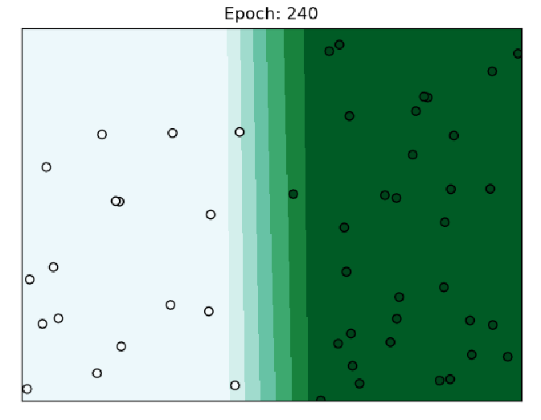
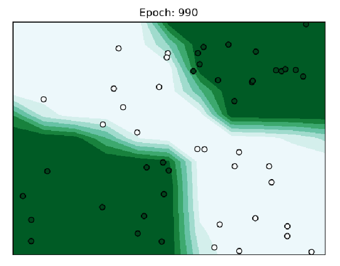

# MiniTorch Module 1  


* Docs: https://minitorch.github.io/

* Overview: https://minitorch.github.io/module1.html

This module requires `operators.py` and `module.py` from Module 0

```
cp ../Module-0/operators.py ../Module-0/module.py minitorch/
```


* Tests:

```
python run_tests.py
```


```
Setting up a new session...
Epoch  0  loss  1.6003782968148694 correct 17 time 2.4274585247039795
Epoch  10  loss  0.42462166320438754 correct 33 time 2.515007734298706
Epoch  20  loss  0.4180628895442639 correct 33 time 2.2282161712646484
Epoch  30  loss  0.4122776446507477 correct 33 time 2.218113422393799
Epoch  40  loss  0.4070062628592133 correct 41 time 2.4075241088867188
Epoch  50  loss  3.278999246798118e-05 correct 33 time 2.271336555480957
Epoch  60  loss  0.9326183441277114 correct 41 time 2.263528347015381
Epoch  70  loss  0.8963150603651503 correct 47 time 2.420417070388794
Epoch  80  loss  0.3983363502679591 correct 50 time 2.1835978031158447
Epoch  90  loss  0.2858262778041832 correct 50 time 2.3679275512695312
Epoch  100  loss  0.276203005923784 correct 50 time 2.5018391609191895
Epoch  110  loss  0.2821058037062314 correct 50 time 2.2159347534179688
Epoch  120  loss  0.7027327416468409 correct 48 time 2.8119897842407227
Epoch  130  loss  0.09854319148202377 correct 50 time 2.329930543899536
Epoch  140  loss  0.08174345792944952 correct 50 time 2.2997851371765137
Epoch  150  loss  0.07645320261404993 correct 50 time 2.456631898880005
Epoch  160  loss  0.06487233612199157 correct 50 time 2.1974642276763916
Epoch  170  loss  0.05558687751962901 correct 50 time 2.1948695182800293
Epoch  180  loss  0.04806099866353339 correct 50 time 2.550110101699829
Epoch  190  loss  0.04189889525795455 correct 50 time 2.227750062942505
Epoch  200  loss  0.03680260774797749 correct 50 time 2.1805648803710938
Epoch  210  loss  0.03102346806120218 correct 50 time 2.2160494327545166
Epoch  220  loss  0.02784805360470475 correct 50 time 2.2064144611358643
Epoch  230  loss  0.025273785076986473 correct 50 time 2.2100627422332764
Epoch  240  loss  0.02293755791065177 correct 50 time 2.1722257137298584
```



```
TBD

Process finished with exit code 0
```


