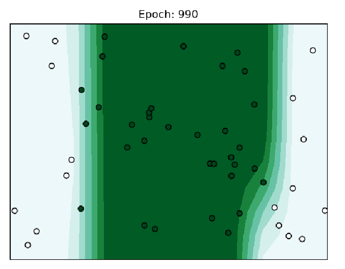

# MiniTorch Module 1  


* Docs: https://minitorch.github.io/

* Overview: https://minitorch.github.io/module1.html

This module requires `operators.py` and `module.py` from Module 0

```
cp ../Module-0/operators.py ../Module-0/module.py minitorch/
```


* Tests:

```
python run_tests.py
```


```
Setting up a new session...
Epoch  0  loss  1.6003782968148694 correct 17 time 2.4274585247039795
Epoch  10  loss  0.42462166320438754 correct 33 time 2.515007734298706
Epoch  20  loss  0.4180628895442639 correct 33 time 2.2282161712646484
Epoch  30  loss  0.4122776446507477 correct 33 time 2.218113422393799
Epoch  40  loss  0.4070062628592133 correct 41 time 2.4075241088867188
Epoch  50  loss  3.278999246798118e-05 correct 33 time 2.271336555480957
Epoch  60  loss  0.9326183441277114 correct 41 time 2.263528347015381
Epoch  70  loss  0.8963150603651503 correct 47 time 2.420417070388794
Epoch  80  loss  0.3983363502679591 correct 50 time 2.1835978031158447
Epoch  90  loss  0.2858262778041832 correct 50 time 2.3679275512695312
Epoch  100  loss  0.276203005923784 correct 50 time 2.5018391609191895
Epoch  110  loss  0.2821058037062314 correct 50 time 2.2159347534179688
Epoch  120  loss  0.7027327416468409 correct 48 time 2.8119897842407227
Epoch  130  loss  0.09854319148202377 correct 50 time 2.329930543899536
Epoch  140  loss  0.08174345792944952 correct 50 time 2.2997851371765137
Epoch  150  loss  0.07645320261404993 correct 50 time 2.456631898880005
Epoch  160  loss  0.06487233612199157 correct 50 time 2.1974642276763916
Epoch  170  loss  0.05558687751962901 correct 50 time 2.1948695182800293
Epoch  180  loss  0.04806099866353339 correct 50 time 2.550110101699829
Epoch  190  loss  0.04189889525795455 correct 50 time 2.227750062942505
Epoch  200  loss  0.03680260774797749 correct 50 time 2.1805648803710938
Epoch  210  loss  0.03102346806120218 correct 50 time 2.2160494327545166
Epoch  220  loss  0.02784805360470475 correct 50 time 2.2064144611358643
Epoch  230  loss  0.025273785076986473 correct 50 time 2.2100627422332764
Epoch  240  loss  0.02293755791065177 correct 50 time 2.1722257137298584
```



```
Setting up a new session...
Epoch  0  loss  1.3961392384750377 correct 17 time 0.21874547004699707
Epoch  10  loss  0.40786784986888885 correct 33 time 0.2031104564666748
Epoch  20  loss  0.3934996844766344 correct 33 time 0.2187337875366211
Epoch  30  loss  0.38701858607479545 correct 33 time 0.218733549118042
Epoch  40  loss  0.3783933569076157 correct 33 time 0.2031095027923584
Epoch  50  loss  0.3457430175007447 correct 33 time 0.2031102180480957
Epoch  60  loss  0.21803698007922798 correct 33 time 0.2031102180480957
Epoch  70  loss  0.337128353935292 correct 33 time 0.2031099796295166
Epoch  80  loss  0.09626615289864549 correct 33 time 0.2031102180480957
Epoch  90  loss  0.2811928096997148 correct 33 time 0.2031102180480957
Epoch  100  loss  0.16066060208705427 correct 33 time 0.20312142372131348
Epoch  110  loss  0.16430557591085537 correct 33 time 0.2343578338623047
Epoch  120  loss  0.18439145077715255 correct 33 time 0.2031106948852539
Epoch  130  loss  0.154098001831335 correct 33 time 0.2031099796295166
Epoch  140  loss  0.1495842955471512 correct 33 time 0.2031099796295166
Epoch  150  loss  0.14932678516817424 correct 33 time 0.2031102180480957
Epoch  160  loss  0.1379799004092155 correct 33 time 0.2031104564666748
Epoch  170  loss  0.14089074462264897 correct 33 time 0.2031102180480957
Epoch  180  loss  0.14273766733656598 correct 33 time 0.2031102180480957
Epoch  190  loss  0.13404273284789522 correct 33 time 0.2031104564666748
Epoch  200  loss  0.12506725057855564 correct 33 time 0.2031097412109375
Epoch  210  loss  0.12237331764792458 correct 33 time 0.24998164176940918
Epoch  220  loss  0.12176374147358067 correct 33 time 0.2031099796295166
Epoch  230  loss  0.1151695660719036 correct 33 time 0.2031095027923584
Epoch  240  loss  0.11025007970780326 correct 33 time 0.2343578338623047
Epoch  250  loss  0.10502245020941153 correct 33 time 0.1874856948852539
Epoch  260  loss  0.11005842586129787 correct 33 time 0.2031104564666748
Epoch  270  loss  0.09531818408383726 correct 33 time 0.2031097412109375
Epoch  280  loss  0.08915110001703432 correct 33 time 0.2188260555267334
Epoch  290  loss  0.07988338394667674 correct 33 time 0.18748688697814941
Epoch  300  loss  0.06920675810757816 correct 33 time 0.2031097412109375
Epoch  310  loss  0.07982820918037395 correct 36 time 0.2187340259552002
Epoch  320  loss  0.02647761912708488 correct 33 time 0.2187342643737793
Epoch  330  loss  0.10971731508774799 correct 34 time 0.2031097412109375
Epoch  340  loss  0.061415323423499674 correct 36 time 0.2031097412109375
Epoch  350  loss  0.04247482055651988 correct 33 time 0.2343578338623047
Epoch  360  loss  0.07562431923214927 correct 38 time 0.2031102180480957
Epoch  370  loss  0.02398624366553915 correct 33 time 0.2031090259552002
Epoch  380  loss  0.07152326453102545 correct 39 time 0.2187345027923584
Epoch  390  loss  0.05032101812997128 correct 41 time 0.2187340259552002
Epoch  400  loss  0.04580170168776507 correct 44 time 0.2031099796295166
Epoch  410  loss  0.4299534292721429 correct 34 time 0.2031114101409912
Epoch  420  loss  0.006198258959291348 correct 35 time 0.2031104564666748
Epoch  430  loss  0.06699566642761515 correct 39 time 0.2031090259552002
Epoch  440  loss  0.03627356625878904 correct 42 time 0.2031102180480957
Epoch  450  loss  0.02921464298121506 correct 39 time 0.2031102180480957
Epoch  460  loss  0.009927087721767602 correct 34 time 0.203110933303833
Epoch  470  loss  0.04388754217359504 correct 35 time 0.2031097412109375
Epoch  480  loss  0.01582406937824104 correct 40 time 0.2031099796295166
Epoch  490  loss  0.013257669174806457 correct 45 time 0.2031097412109375
Epoch  500  loss  0.003418580618968318 correct 36 time 0.2187333106994629
Epoch  510  loss  0.003070481469555252 correct 34 time 0.1874861717224121
Epoch  520  loss  0.0029705206576617115 correct 34 time 0.2031102180480957
Epoch  530  loss  0.003445948733666904 correct 43 time 0.218733549118042
Epoch  540  loss  0.0060986944311039884 correct 39 time 0.2187340259552002
Epoch  550  loss  0.0033354631037987846 correct 37 time 0.2031102180480957
Epoch  560  loss  0.0029704304093682815 correct 38 time 0.2031111717224121
Epoch  570  loss  0.0020237791200066733 correct 37 time 0.2031099796295166
Epoch  580  loss  0.0018970037570354083 correct 37 time 0.2187342643737793
Epoch  590  loss  0.0025894218100362435 correct 44 time 0.2031092643737793
Epoch  600  loss  0.0033390460135563614 correct 41 time 0.2031087875366211
Epoch  610  loss  0.0031442195382881126 correct 45 time 0.2343578338623047
Epoch  620  loss  0.007010638983894131 correct 46 time 0.2187340259552002
Epoch  630  loss  0.003383879913522973 correct 34 time 0.3054468631744385
Epoch  640  loss  0.002363411153387951 correct 44 time 0.2031095027923584
Epoch  650  loss  0.005552701829943816 correct 46 time 0.2031238079071045
Epoch  660  loss  0.0015945854212791948 correct 43 time 0.21069025993347168
Epoch  670  loss  0.0062427927213975455 correct 47 time 0.21425199508666992
Epoch  680  loss  0.001301029693990986 correct 43 time 0.20218563079833984
Epoch  690  loss  0.005233002202509153 correct 47 time 0.20126724243164062
Epoch  700  loss  0.0012114448583601869 correct 46 time 0.22095322608947754
Epoch  710  loss  0.0028038332947062056 correct 42 time 0.2163374423980713
Epoch  720  loss  0.0021006775754549476 correct 48 time 0.20721673965454102
Epoch  730  loss  0.0008182924924392321 correct 46 time 0.24349451065063477
Epoch  740  loss  0.002205253366336208 correct 41 time 0.21110796928405762
Epoch  750  loss  0.0022623438115446986 correct 48 time 0.22909760475158691
Epoch  760  loss  0.0007798996029355626 correct 46 time 0.20250201225280762
Epoch  770  loss  0.000917275994106359 correct 44 time 0.2343463897705078
Epoch  780  loss  0.0015838798259112062 correct 38 time 0.20311594009399414
Epoch  790  loss  0.0018880202233763272 correct 49 time 0.2031097412109375
Epoch  800  loss  0.0006027160026996613 correct 48 time 0.2031102180480957
Epoch  810  loss  0.0005641233689626257 correct 46 time 0.23434686660766602
Epoch  820  loss  0.0008048474197139269 correct 47 time 0.21587419509887695
Epoch  830  loss  0.0005391941277097958 correct 47 time 0.20266985893249512
Epoch  840  loss  0.0004656995867023623 correct 46 time 0.20708131790161133
Epoch  850  loss  0.0005189282688447089 correct 47 time 0.2106935977935791
Epoch  860  loss  0.0004372793225812099 correct 47 time 0.23164844512939453
Epoch  870  loss  0.00036906957409154473 correct 47 time 0.22323989868164062
Epoch  880  loss  0.0003621555818046743 correct 47 time 0.21225190162658691
Epoch  890  loss  0.00033084456371236146 correct 47 time 0.21205687522888184
Epoch  900  loss  0.00030145937003215955 correct 47 time 0.2215251922607422
Epoch  910  loss  0.00027927271493772746 correct 47 time 0.22194433212280273
Epoch  920  loss  0.0002617683192603943 correct 47 time 0.20276618003845215
Epoch  930  loss  0.00023335055297139034 correct 47 time 0.20418024063110352
Epoch  940  loss  0.00021700567018141605 correct 47 time 0.20278000831604004
Epoch  950  loss  0.0002046396525180379 correct 48 time 0.2142040729522705
Epoch  960  loss  0.00018207128996661296 correct 48 time 0.21105408668518066
Epoch  970  loss  0.00016831122435459782 correct 48 time 0.21295475959777832
Epoch  980  loss  0.00015783695798787364 correct 48 time 0.25141263008117676
Epoch  990  loss  0.0001483748245822108 correct 48 time 0.21088624000549316
```


```
Setting up a new session...
Epoch  0  loss  3.7508498129756855 correct 22 time 0.23269200325012207
Epoch  10  loss  0.5864857480702758 correct 28 time 0.19264698028564453
Epoch  20  loss  0.5548394756061703 correct 28 time 0.19459319114685059
Epoch  30  loss  0.5562135218529952 correct 32 time 0.20270776748657227
Epoch  40  loss  0.9120357054969769 correct 26 time 0.20270252227783203
Epoch  50  loss  0.5280537671686671 correct 32 time 0.21068072319030762
Epoch  60  loss  0.35348727545900593 correct 28 time 0.20269393920898438
Epoch  70  loss  0.35924916760416764 correct 28 time 0.2026653289794922
Epoch  80  loss  0.24354390320100117 correct 28 time 0.21285605430603027
Epoch  90  loss  0.2679703975176591 correct 28 time 0.21070480346679688
Epoch  100  loss  0.2491755511192537 correct 28 time 0.2027299404144287
Epoch  110  loss  0.2372853159723282 correct 28 time 0.2025444507598877
Epoch  120  loss  0.2371954408478303 correct 28 time 0.20262694358825684
Epoch  130  loss  0.19801182618675214 correct 28 time 0.2312309741973877
Epoch  140  loss  0.21463908208748667 correct 28 time 0.2613999843597412
Epoch  150  loss  0.18246274763498455 correct 29 time 0.20262932777404785
Epoch  160  loss  0.18964714193073673 correct 29 time 0.21277785301208496
Epoch  170  loss  0.15119973742811574 correct 30 time 0.2026207447052002
Epoch  180  loss  0.13559557666893932 correct 30 time 0.20263433456420898
Epoch  190  loss  0.14851055344845865 correct 31 time 0.20254230499267578
Epoch  200  loss  0.12090500611263465 correct 31 time 0.20270705223083496
Epoch  210  loss  0.12093601595650172 correct 31 time 0.20270991325378418
Epoch  220  loss  0.10987664010025987 correct 31 time 0.20258641242980957
Epoch  230  loss  0.0935717611760662 correct 32 time 0.20259642601013184
Epoch  240  loss  0.07203716096955255 correct 31 time 0.20267462730407715
Epoch  250  loss  0.10492437809766877 correct 32 time 0.20265769958496094
Epoch  260  loss  0.07333749676845588 correct 32 time 0.20468974113464355
Epoch  270  loss  0.0852345626311102 correct 32 time 0.2027277946472168
Epoch  280  loss  0.0719042830410202 correct 32 time 0.20251750946044922
Epoch  290  loss  0.08147612107405379 correct 33 time 0.20247769355773926
Epoch  300  loss  0.052924823750490776 correct 32 time 0.2026979923248291
Epoch  310  loss  0.0573479699005546 correct 33 time 0.20272350311279297
Epoch  320  loss  0.055376974051527555 correct 34 time 0.2027754783630371
Epoch  330  loss  0.050306598567541036 correct 34 time 0.20262718200683594
Epoch  340  loss  0.04454043456675937 correct 34 time 0.20279312133789062
Epoch  350  loss  0.04583233010723415 correct 34 time 0.20249557495117188
Epoch  360  loss  0.07209012418427091 correct 35 time 0.202592134475708
Epoch  370  loss  0.04520079702397496 correct 35 time 0.2026827335357666
Epoch  380  loss  0.03236826128015483 correct 34 time 0.20246481895446777
Epoch  390  loss  0.05424751165736918 correct 35 time 0.20266938209533691
Epoch  400  loss  0.015660947374756616 correct 37 time 0.20266270637512207
Epoch  410  loss  0.13520344933452838 correct 36 time 0.20268750190734863
Epoch  420  loss  0.026695607922837573 correct 38 time 0.20267152786254883
Epoch  430  loss  0.024075216111244913 correct 38 time 0.21073436737060547
Epoch  440  loss  0.025421880097891033 correct 40 time 0.21278071403503418
Epoch  450  loss  0.009755360977437616 correct 39 time 0.20258188247680664
Epoch  460  loss  0.0041226381856333105 correct 38 time 0.20268869400024414
Epoch  470  loss  0.001304267100315139 correct 36 time 0.20265984535217285
Epoch  480  loss  0.01137973734752981 correct 42 time 0.20257163047790527
Epoch  490  loss  0.004933632563086532 correct 43 time 0.2047264575958252
Epoch  500  loss  0.011484608682564283 correct 46 time 0.20263147354125977
Epoch  510  loss  0.015437058100748852 correct 45 time 0.204697847366333
Epoch  520  loss  0.002181068318161214 correct 40 time 0.19223761558532715
Epoch  530  loss  0.012549630637524659 correct 45 time 0.20268630981445312
Epoch  540  loss  0.0014819635866759147 correct 39 time 0.2029728889465332
Epoch  550  loss  0.001840665301212401 correct 43 time 0.2418043613433838
Epoch  560  loss  0.013574230002970387 correct 48 time 0.2026364803314209
Epoch  570  loss  0.0006715495093608116 correct 38 time 0.2512845993041992
Epoch  580  loss  0.002607412572332352 correct 44 time 0.20266938209533691
Epoch  590  loss  0.14370490160572286 correct 44 time 0.20182228088378906
Epoch  600  loss  0.0017597693521920444 correct 44 time 0.2026965618133545
Epoch  610  loss  0.07719331486859982 correct 45 time 0.20343685150146484
Epoch  620  loss  0.09983454134007666 correct 47 time 0.21056032180786133
Epoch  630  loss  0.07871794103055205 correct 46 time 0.2122347354888916
Epoch  640  loss  3.1197190559775763 correct 36 time 0.2006397247314453
Epoch  650  loss  0.5852960251674003 correct 45 time 0.20160818099975586
Epoch  660  loss  0.3477130736597853 correct 46 time 0.20229625701904297
Epoch  670  loss  3.631938308945713 correct 37 time 0.20255494117736816
Epoch  680  loss  0.07002146501130119 correct 48 time 0.1924140453338623
Epoch  690  loss  0.1271727342215393 correct 47 time 0.2020716667175293
Epoch  700  loss  0.004787206218665996 correct 50 time 0.20198845863342285
Epoch  710  loss  0.009597982472836556 correct 50 time 0.20253419876098633
Epoch  720  loss  0.002179395959857446 correct 48 time 0.22209620475769043
Epoch  730  loss  0.000578224254576848 correct 48 time 0.2714526653289795
Epoch  740  loss  0.0015899240969626317 correct 44 time 0.20218372344970703
Epoch  750  loss  0.005830933392458523 correct 49 time 0.2216484546661377
Epoch  760  loss  0.0036561102139692396 correct 48 time 0.20253992080688477
Epoch  770  loss  1.3213433338677496e-05 correct 37 time 0.2045576572418213
Epoch  780  loss  1.7787722232383825 correct 42 time 0.21150469779968262
Epoch  790  loss  1.6857814224891543 correct 42 time 0.21904850006103516
Epoch  800  loss  1.563521905194489 correct 41 time 0.19457435607910156
Epoch  810  loss  1.6107709173276916 correct 43 time 0.20229315757751465
Epoch  820  loss  0.00977286819951839 correct 48 time 0.2026984691619873
Epoch  830  loss  0.04374087183900214 correct 48 time 0.20253682136535645
Epoch  840  loss  0.008452933871125189 correct 43 time 0.20056939125061035
Epoch  850  loss  0.009201569622444544 correct 49 time 0.2091081142425537
Epoch  860  loss  0.017330448151176302 correct 49 time 0.20286989212036133
Epoch  870  loss  0.017120369271329063 correct 49 time 0.241485595703125
Epoch  880  loss  0.015640783239675014 correct 49 time 0.20246481895446777
Epoch  890  loss  0.015269652472566933 correct 49 time 0.21249938011169434
Epoch  900  loss  0.00905654928415365 correct 49 time 0.23320293426513672
Epoch  910  loss  0.005768726150862443 correct 49 time 0.23111724853515625
Epoch  920  loss  0.0042295479922751355 correct 49 time 0.2239372730255127
Epoch  930  loss  0.0031902897710516186 correct 49 time 0.20256733894348145
Epoch  940  loss  0.0023016679182092047 correct 49 time 0.20227479934692383
Epoch  950  loss  0.0017007995373532583 correct 49 time 0.20410799980163574
Epoch  960  loss  0.0009475651135953853 correct 49 time 0.24192142486572266
Epoch  970  loss  0.0004461319164651988 correct 50 time 0.20215654373168945
Epoch  980  loss  0.0002659061557171454 correct 50 time 0.24138450622558594
Epoch  990  loss  0.0001807196232368809 correct 50 time 0.20177936553955078

Process finished with exit code 0
```


